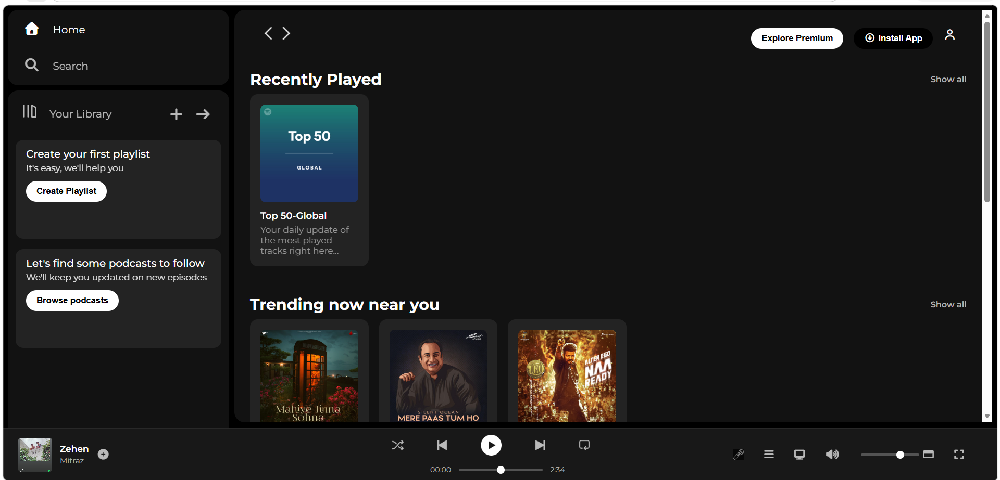

# Spotify Clone 🎵

A front-end clone of the Spotify Web Player built using HTML and CSS.

## Features

- 🎵 Music player footer with controls and progress bar
- 📚 Sidebar with navigation and library section
- 🎨 Responsive card sections with hover play button
- 🔍 Sticky navigation bar
- 📱 Responsive design for smaller screens

## Preview

## Tech Stack

- HTML
- CSS

## Sections

- **Sidebar** — Home, Search, Your Library, Create Playlist, Browse Podcasts
- **Main Content** — Recently Played, Trending Now Near You, Featured Charts
- **Music Player** — Album info, Playback controls, Progress bar, Volume control

## How to Run

1. Clone the repository
2. Open 'index.html' in your browser

## Credits

- Inspired by [Spotify](https://open.spotify.com)
- Icons by [Font Awesome](https://fontawesome.com)
- Font by [Google Fonts](https://fonts.google.com)
